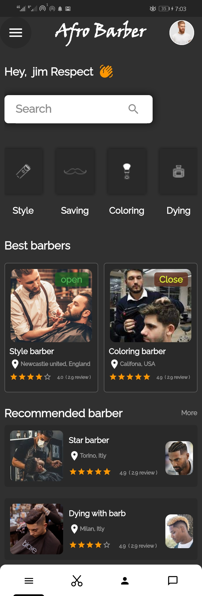
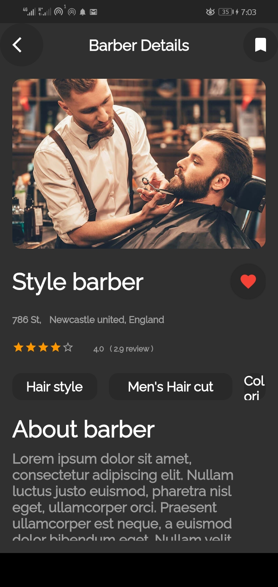
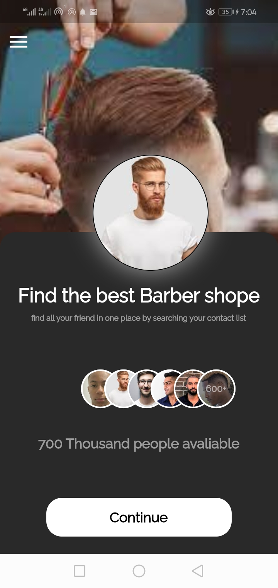
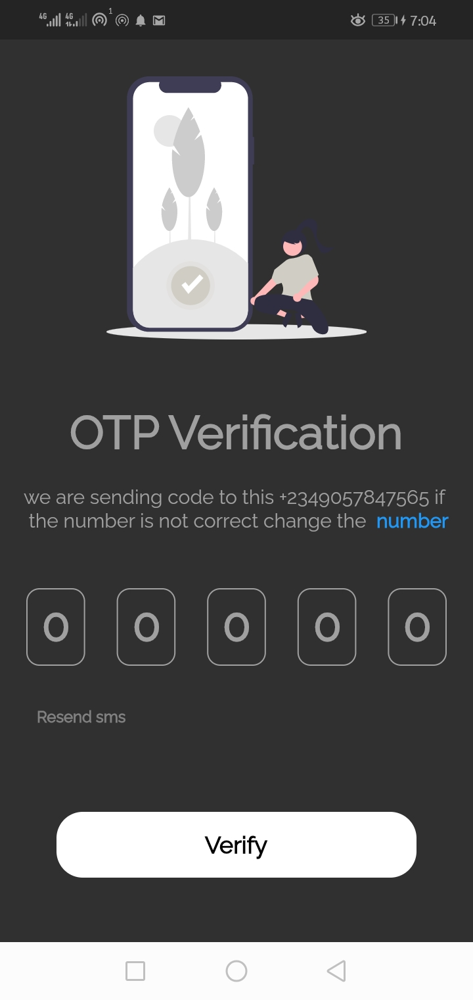
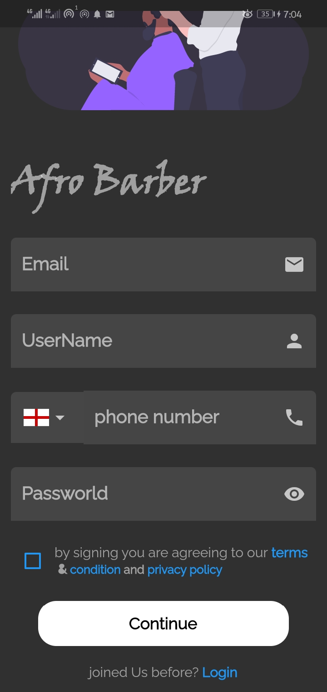
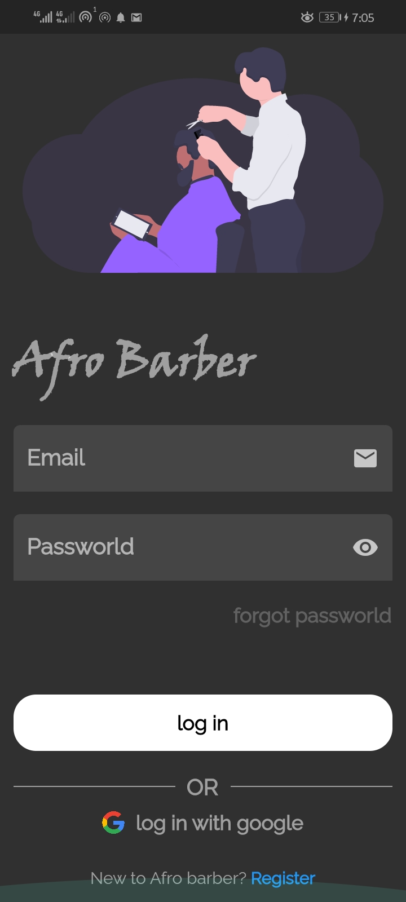
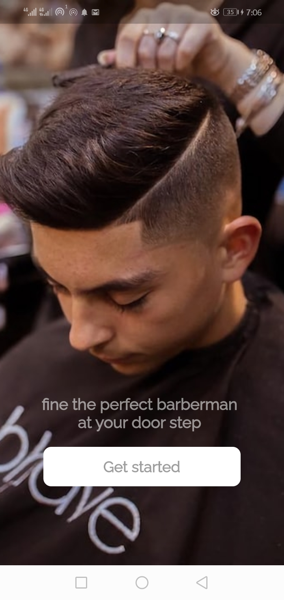

# Afro Barber App

**Afro Barber** is a Flutter mobile application that connects barbers with clients. Barbers can showcase their skills, and clients can discover and book appointments with their favorite barbers.

## Table of Contents

- [Features](#features)
- [Screenshots](#screenshots)
- [Getting Started](#getting-started)
- [Dependencies](#dependencies)
- [Contributing](#contributing)
- [License](#license)

## Features

- **Landing Page**: Welcome screen with an overview of the app.

- **Login and Sign Up**: Secure authentication for both barbers and clients.

- **Barber Profile**: Barbers can create profiles to showcase their skills, portfolio, and contact information.

- **Client Profile**: Clients can view barber profiles, book appointments, and manage their bookings.

- **Payment Integration**: Seamless payment processing for appointments.

## Screenshots

## Getting Started

Follow these steps to get the "Afro Barber" app up and running on your local machine:

1. Clone this repository:
   `shell`
   git clone https://github.com/Ridwan093/Afro_barber.git

2. Navigate to the project directory:
   `cd afro_barber`
3. Install dependencies:
   `flutter pub get`
4. Run the app:
   `flutter run`

Dependencies
This project uses the following packages and technologies:

Flutter: https://flutter.dev
Add any other relevant dependencies here.
Contributing
Contributions are welcome! If you'd like to contribute to the project, please follow these steps:

Fork the repository.
Create a new branch for your feature or bug fix.
Make your changes and commit them with clear and concise messages.
Push your changes to your forked repository.
Create a pull request to the main repository.
License
This project is licensed under the MIT License - see the LICENSE file for details.

# afro_barber

# afro_barber
